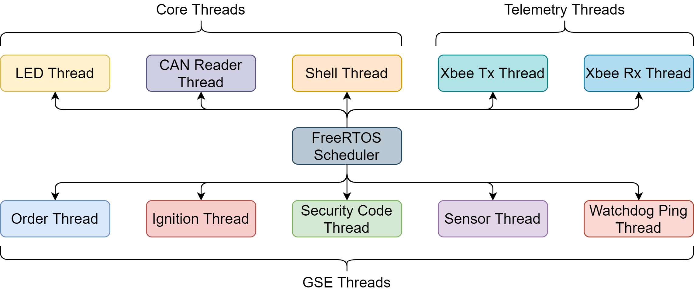
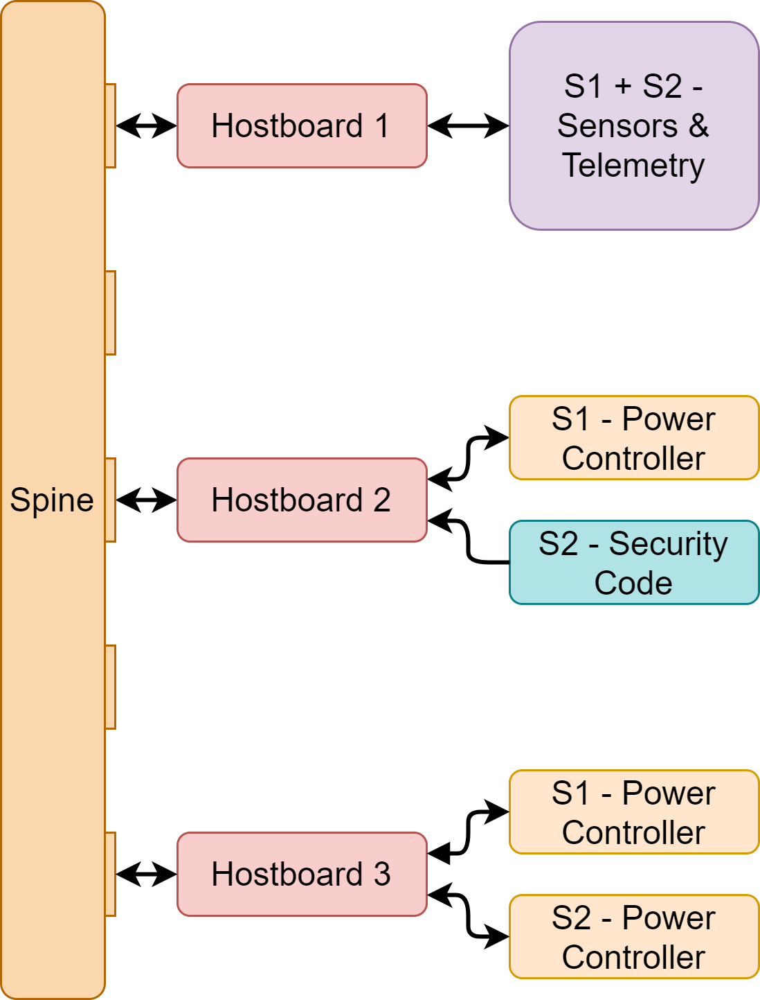
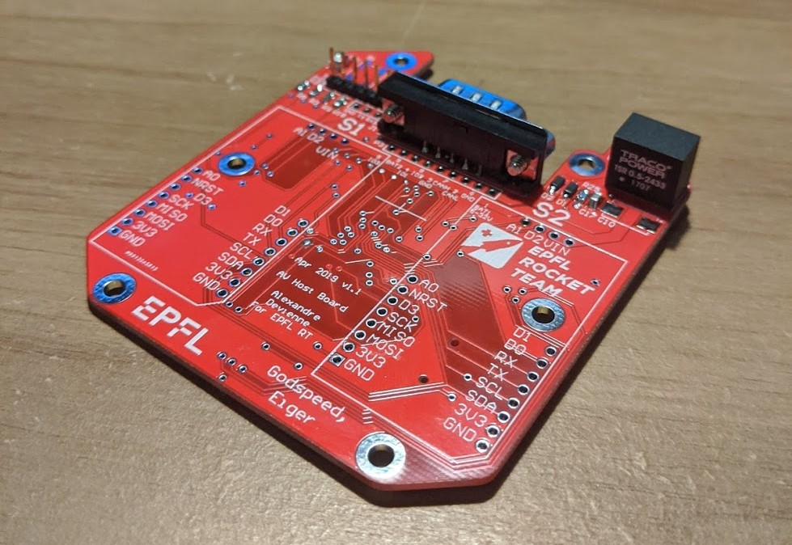
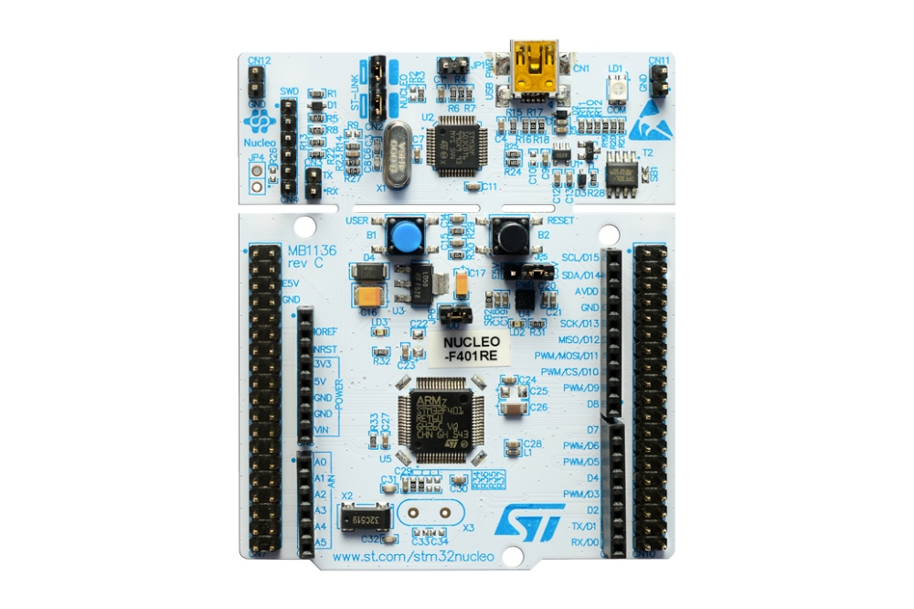
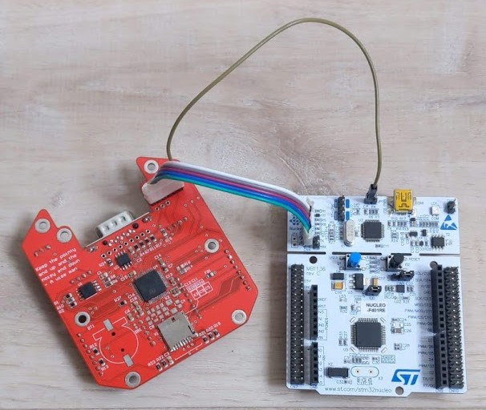

# EPFL Rocket Team - <em>Bella Lui GSE Software</em>

## Table of Contents
1. [Abstract](#abstract)
2. [File Structure](#file-structure)
3. [Thread Architecture](#thread-architecture)
4. [Requirements](#requirements)
5. [Importing the project in STM32CubeIDE](#importing-the-project-in-stm32cubeide)
6. [Building the Software](#building-the-software)
7. [Flashing the Hostboards](#flashing-the-hostboards)
8. [Miscellaneous](#miscellaneous)
<!-- 9. [Troubleshooting](#troubleshooting) -->

## Abstract
### Project purpose 
The EPFL Rocket Team association will be participating in the 10’000 feet 
SRAD Hybrid Engine category of the 2021 Virtual Spaceport America Cup, which will be held in June 2021. 
For more information, visit https://epflrocketteam.ch/ :rocket:

### Description
This repository contains the software of the <b>Ground Segment subsystem</b> dedicated to the <b>Ground Support Equipment</b>, or <b>GSE</b>.\
The main goal of this software is to run the operations in the Launch Area. Which, for safety reasons, are all done remotely from the <b>Ground Station</b>.\
To acheieve this, this software comports different features, mainly dedicated to the control of actuators, the aquisition of sensors, safety features, as well as the critical management of the radio communication with other subsystems.\
This piece of software is meant to be run on EPFL Rocket Teams "Hostboards", our custom PCBs housing a STM32F446RET6 microcontroller. And for a completely functional setup, 3 Hostboards need to be used, all of them connected to each other through a CAN bus.\
This software is being developped in C on STM32CubeIDE, using FreeRTOS, the CMSIS abstraction layer, and with heavy inpiration from the 2020 AV Code located at: https://github.com/EPFLRocketTeam/BellaLui for many of the core functionnality.\
As for the Radio communication, this is established using [Xbee RF modems](https://www.digi.com/products/embedded-systems/digi-xbee/rf-modules/sub-1-ghz-rf-modules/digi-xbee-sx-868) available on external custom PCBs from the team (868 MHz in EU/CH and 915 MHz in the USA).

## File Structure
```
BellaLuiGSE
│   README.md
└───Application
│   └───Src                     User-defined source files
│   │   └───debug               Contains all the debugging source files
│   │   └───GSE                 Contains all GSE Specific source files
│   │   └───telemetry           Contains all the Telemetry related source files
│   │   can_reception.c         All functions related to receiving messages on the CAN bus
│   │   can_transmission.c      All functions related to transmitting messages on the CAN bus
│   │   sync.c                  Synchronisation logic used by some debugging functions
│   │   thread_init.c           Thread initialisations
│   |
│   └───Inc                     User-defined header files
│   │   └───debug               Contains all the debugging header files
│   │   └───GSE                 Contains all GSE Specific header files
│   │   └───misc                Contains common enum/structure definitions
│   │   └───telemetry           Contains all the Telemetry related header files
│   │   can_reception.h         All defintions related to receiving messages on the CAN bus
│   │   can_transmission.h      All definitions to transmitting messages on the CAN bus
│   │   sync.h                  Synchronisation logic used by some debugging functions
│   │   thread_init.h           Thread initialisations, choice of Hostboard code to flash
│
└───Core                        Core functionnality
│   └───Src                     Core source files
│   │   main.c                  Main file, program starting point
│   │   other system source files
│   |
│   └───Inc                     Core header files
│   │   main.h                  Main file header
|   |   FreeRTOSConfig.h        FreeRTOS main config file
│   │   other system header files
│
└───Drivers
│   └───CMSIS                   CMSIS HAL Core
│   └───STM32F4xx_HAL_Driver    CMSIS HAL Drivers
│
└───Middlewares
│   └───Third_Party             Contains all Thrid Party software used
│   │   └───FreeRTOS            FreeRTOS source code
|
|   BellaLuiGSE.ioc             STM32CubeIDE main configuration file
|   other auto-generated files
```

## Thread Architecture
This software is heavily using the multi-threading functionnality of FreeRTOS, several threads have thus been implemented to manage all required functionnalities of the GSE.



And as mentionned also above, a complete setup using this software requires 3 Hostboards to be complete.\
Each of these need to be flashed by a different version of the software, all of them containing different running threads when running.\
This thread definitions are pre-configured in the threads_init.h file, the main Hostboard define only needs to be properly selected to select the part of the code for each Hostboard.



## Requirements

### Development tools
* STM32CubeIDE: Available for free [here](https://www.st.com/en/development-tools/stm32cubeide.html) on Windows, MacOS and Linux.
* git: Either command-line or GUI versions will do. Instructions to get the command line version are availble [here](https://git-scm.com/downloads).
* [OPTIONAL] A git GUI Client : I would recommend [Gitkraken](https://www.gitkraken.com/), but [SublimeMerge](https://www.sublimemerge.com/), [Github Desktop](https://desktop.github.com/) or any other will do, this is a matter of personal preference.

### Hardware

* [1-3] EPFL Rocket Team Hostboard (the code can be developped on 1 Hostboard, but 3 are needed for the complete assembly)
  
* [1] [STM32 Nucleo-64 development board](https://www.st.com/en/evaluation-tools/nucleo-f446re.html), used to flash the code on the Hostboards
  
* [1] Spine, to connect the Hostboards together for a complete assembly
* A set of 6 jumper wires, to make the connection between the Nucleo board and the Hostboard.

## Importing the project in STM32CubeIDE

The software first needs to be imported into STM32CubeIDE.\
First to get the software, open a terminal, navigate to the folder where you want to download the softwre, and type:

```
git clone https://github.com/EPFLRocketTeam/BellaLuiGSE.git
```
Then open STM32CubeIDE, press File->"Open Projects from File System..."\
Press Directory to find the folder where you downloaded the software, then press Select Folder.\
Press Finish.\
Congratulations! The software has been imported. You can now navigate through the file system and are ready to build!

## Building the Software

As for the development, STM32CubeIDE is also used to build the software.\
To build the software, press *Ctrl-B*, Project->"Build All", or the Hammer Icon in the toolbar.\
A debug sub-folder will then be created in the folder where the software is located, containing all the temporary files as well as the final compiled files to be flashed, the one of interest here being the .elf file.

## Flashing the Hostboards

### Hardware Setup

To flash the board either way, the same hardware setup is used, and it is as follows:

* Remove JP1, the jumper at the top of the Nucleo board, to the right of the USB connector.
* Connect the 2 PCBs as seen below.



* Plug the Nucleo board to your Computer via USB.

### Flashing methods

There are 2 ways of flashing the Hostboards, each used for different applications.\
* **Run**: This is used to flash the Hostboard with the software for it to run on its own, without the debugger. 
  - When this method is used, the software will restart automatically when the Hostboard is powered.
  - To Run the software on the Hostboard, press Run->Run, or the Green Play Icon in the toolbar 
* **Debug**: This is used, as the name implies, to debug the software. 
  - The program does not stay on the MCU when the debugger is disconnected, and will not start again when the Hostboard is powered on.
  - To debug the software on the Hostboard, press Run->Debug, or the Bug Icon in the toolbar

## Miscellaneous

### Authors
* [Lucas Pallez](https://www.linkedin.com/in/lucas-pallez-37b47b1a4/)

### Acknowledgments
* [ERT Avionics Software](https://github.com/EPFLRocketTeam/BellaLui)
* [EPFL Rocket Team](https://epflrocketteam.ch/fr/)

<!-- ### Useful links -->

<!-- ## Troubleshooting -->